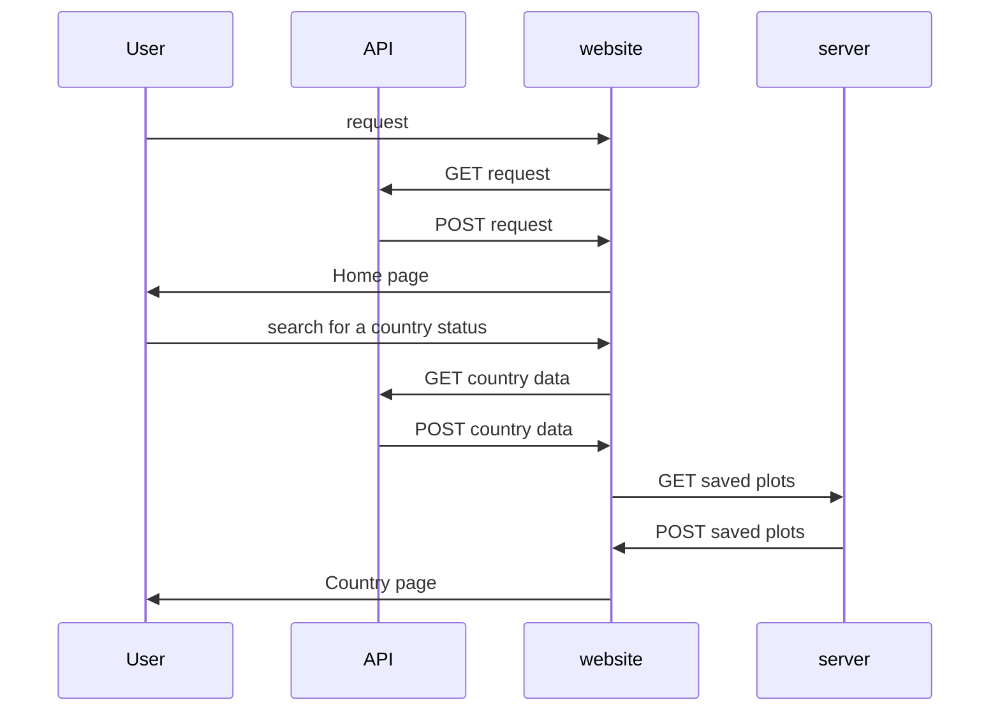

# Documentation

## Purpose

Our purpose of the website is to allow our user's to be fully updated by the numbers of  cases in every country and all of the world.

## Scope

"COVID-19 Tracker" is a web application to provide accurate and up to date data concern the pandemic crisis the new "Corona Virus COVID-19 ". This web application, based on a very simple concepts and design, gives the user all the information of every country, the world and also a very specific and data information. 

## Product perspective

the web application requires a constant and stable data connection to fetch the data from the API and to be constantly updated by the new information that the API provides every 10 minutes.

### Hardware Interfaces: 

It is recommended to use this web application from your PC. It could work on a Mobile but it will not give the best performance and experience.

### 	User interfaces

At first the user should see the the home page which have the world live status from the Total of the cases in the world, total deaths, total recovered, new daily cases, new daily deaths and the number of affected countries. Then by scrolling down the user will find a list with all the countries to choose from and then a search button. 

Then, there is a table with all the affected countries in the world, which gives a quick view of the status of each country. If the user wants a specific and overall information on  a specific country, then he chooses the country which he wants to insect, then it will takes him to the country page which have all the information on this country case and also some graphs that shows the behavior of the new cases deaths and the reproductive number form the date of the appearance of the first case.

## Architecture of the website

​	

